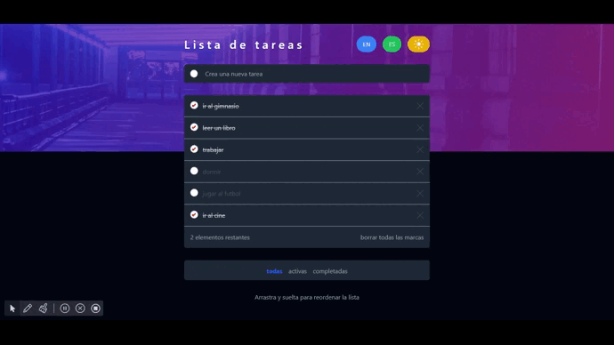
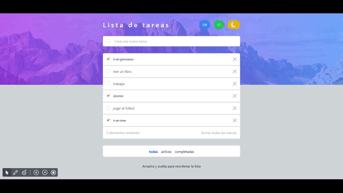

# Proyecto ToDo-App

Este proyecto ha sido creado utilizando Vite, una herramienta de desarrollo web rápida para proyectos con React. A continuación, se detallan algunas de las características clave:

## Tecnologías Utilizadas

1. **Tailwind CSS:** Los estilos del proyecto se han construido utilizando Tailwind CSS, una biblioteca de utilidades de estilo de bajo nivel.

2. **i18next:** Para la traducción de idiomas, este proyecto utiliza la biblioteca i18next, que proporciona una solución completa para la internacionalización.

3. **Tema Oscuro/Luz:** Se ha implementado un tema oscuro y claro para brindar a los usuarios la opción de seleccionar su preferencia de modo visual.

4. **hello-pangea/dnd:** Libreria utilizada con la finalidad de poder arrastrar y soltar las tareas (drag and drop)

## Instrucciones de Desarrollo

### Instalación

```bash
npm install
```




